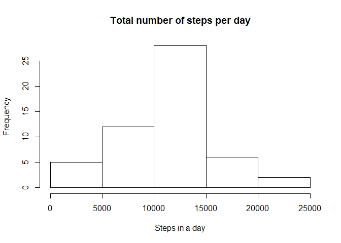
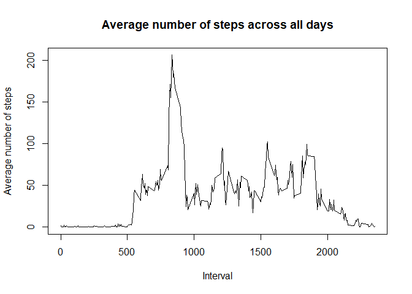
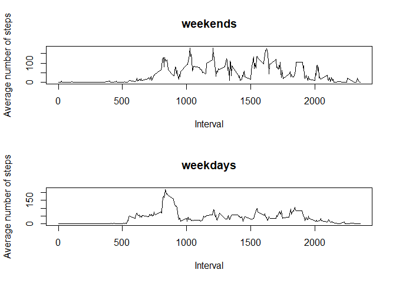

## Loading all packages


```r
library(dplyr)
```

```
## Warning: package 'dplyr' was built under R version 3.6.3
```

```
## 
## Attaching package: 'dplyr'
```

```
## The following objects are masked from 'package:stats':
## 
##     filter, lag
```

```
## The following objects are masked from 'package:base':
## 
##     intersect, setdiff, setequal, union
```

```r
library(knitr)
```

```
## Warning: package 'knitr' was built under R version 3.6.2
```

## Loading and preprocessing the data

Show any code that is needed to

1. Load the data (i.e. \color{red}{\verb|read.csv()|}read.csv())

2. Process/transform the data (if necessary) into a format suitable for your analysis


```r
## setwd
setwd("D:/Desktop/JuanMa/Coursera/Data Science/Reproducible Research/Course Project 1")

## Loading and preprocessing the data
data <- read.table("activity.csv", header = TRUE, sep = ",")
data$date<- as.Date(data$date)

# remove NA
data2<- data[!is.na(data$steps),]
```

## What is mean total number of steps taken per day?
For this part of the assignment, you can ignore the missing values in the dataset.

1. Calculate the total number of steps taken per day

2. If you do not understand the difference between a histogram and a barplot, research the difference between them. Make a histogram of the total number of steps taken each day

3. Calculate and report the mean and median of the total number of steps taken per day


```r
# calculate de total steps per day
df<- data.frame(steps.day = with(data2, tapply(steps, date, FUN=sum)))
```


```r
## Histogram of the total number of steps taken each day
hist(df$steps.day, 
     main = "Total number of steps per day", 
     xlab = "Steps in a day")
```

<!-- -->


```r
# mean and median of the total number of steps taken per day
mean.day<- mean(df$steps.day)
median.day<- median(df$steps.day)
```

**Mean** of total number of steps per day is 1.0766189\times 10^{4}, **median** is 10765.

## What is the average daily activity pattern?

1. Make a time series plot (i.e. type = "l") of the 5-minute interval (x-axis) and the average number of steps taken, averaged across all days (y-axis)

2. Which 5-minute interval, on average across all the days in the dataset, contains the maximum number of steps?


```r
df2<- data.frame(steps.int = with(data2, tapply(steps, interval, FUN=mean)))
df2$interval<- rownames(df2)
```


```r
plot(df2$interval, df2$steps.int, 
     type='l', 
     main="Average number of steps across all days", 
     xlab="Interval", 
     ylab="Average number of steps")
```

<!-- -->


```r
max_int<- df2[which.max(df2$steps.int),]
```

The interval  **835** has the maximum average value of steps **(206.1698113)**

## Imputing missing values

Note that there are a number of days/intervals where there are missing values (coded as NA). The presence of missing days may introduce bias into some calculations or summaries of the data.

1. Calculate and report the total number of missing values in the dataset (i.e. the total number of rows with NAs)

2. Devise a strategy for filling in all of the missing values in the dataset. The strategy does not need to be sophisticated. For example, you could use the mean/median for that day, or the mean for that 5-minute interval, etc.

3. Create a new dataset that is equal to the original dataset but with the missing data filled in.

4. Make a histogram of the total number of steps taken each day and Calculate and report the mean and median total number of steps taken per day. Do these values differ from the estimates from the first part of the assignment? What is the impact of imputing missing data on the estimates of the total daily number of steps?


```r
na<- sum(is.na(data))
```

The total number of **NA** is **2304** 


```r
# Create a new dataset that is equal to the original dataset but with the missing data filled in.
data3<- data
for (i in 1:nrow(data3)){
  if (is.na(data3$steps[i])){
    interval_val <- data3$interval[i]
    steps_val <- df2$steps[which(df2$interval == interval_val)]
    data3$steps[i] <- steps_val
  }
}

## Histogram of the total number of steps taken each day
df3<- data.frame(steps.day = with(data3, tapply(steps, date, FUN=sum)))
```


```r
hist(df$steps.day, 
     main = "Total number of steps per day", 
     xlab = "Steps in a day")
```

<!-- -->


```r
mean.day2<- mean(df3$steps.day)
median.day2<- median(df3$steps.day)
```

**Mean** of total number of steps per day is 1.0766189\times 10^{4}, **median** is 1.0766189\times 10^{4}.

## Are there differences in activity patterns between weekdays and weekends?

For this part the weekdays() function may be of some help here. Use the dataset with the filled-in missing values for this part.

1. Create a new factor variable in the dataset with two levels -- "weekday" and "weekend" indicating whether a given date is a weekday or weekend day.

2. Make a panel plot containing a time series plot (i.e. type = "l") of the 5-minute interval (x-axis) and the average number of steps taken, averaged across all weekday days or weekend days (y-axis).


```r
## number of steps taken per 5-minute interval across weekdays and weekends
data4<- data3
data4$day<- weekdays(data4$date)

day_label<- vector()
for(i in 1:nrow(data4)){
  if ( data4$day[i] == "s攼㸱bado"){
    day_label[i]<- "weekend"
  } else if ( data4$day[i] == "domingo") { 
    day_label[i]<- "weekend"
  } else { 
    day_label[i]<- "weekday"
  }
}
data4$day_label<- day_label

data_weekday<- filter(data4, day_label == "weekday")
data_weekend<- filter(data4, day_label == "weekend")

df4<- data.frame(steps.int = with(data_weekday, tapply(steps, interval, FUN=mean)))
df4$interval<- rownames(df4)
df5<- data.frame(steps.int = with(data_weekend, tapply(steps, interval, FUN=mean)))
df5$interval<- rownames(df5)
```


```r
par(mfrow=c(2,1))
plot(df5$interval, df5$steps.int, 
     type='l', 
     main="weekends", 
     xlab="Interval", 
     ylab="Average number of steps")
plot(df4$interval, df4$steps.int, 
     type='l', 
     main="weekdays", 
     xlab="Interval", 
     ylab="Average number of steps")
```

<!-- -->
